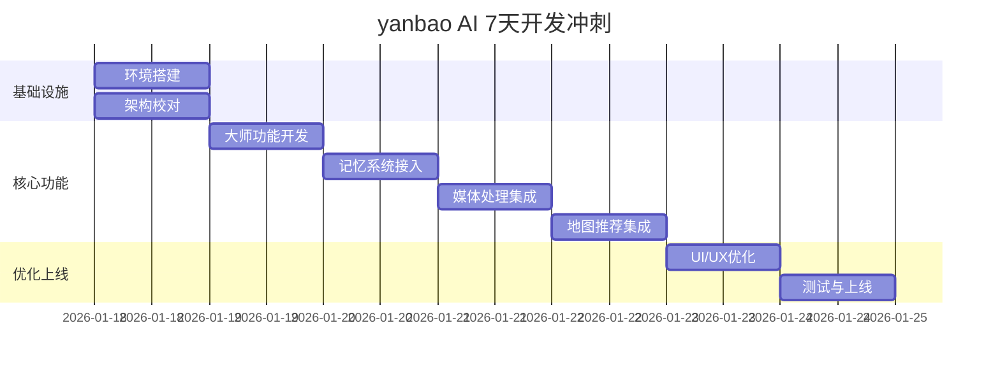

# yanbao AI - 7 天封闭开发冲刺计划

## 📅 Sprint 概览

**目标**: 完成 yanbao AI 核心功能开发，准备上线  
**时间**: 7 天（2026年1月18日 - 2026年1月24日）  
**团队**: 1-2 名开发者 + Manus AI 辅助  
**工作模式**: 封闭开发，每天 8-10 小时

---

## 📊 整体进度规划



---

## 📆 Day 1: 环境搭建与架构校对

### 🎯 目标
- ✅ 完成开发环境配置
- ✅ 导入 Mermaid 架构到 Manus
- ✅ 配置 API 路由
- ✅ 验证基础设施

### 📋 任务清单

#### 上午 (4 小时)

**1. 环境搭建 (2 小时)**
```bash
# 克隆项目
gh repo clone Tsaojason-cao/yanbao-imaging-studio
cd yanbao-imaging-studio

# 安装依赖
pnpm install

# 配置环境变量
cp .env.example .env
# 编辑 .env 填入 API keys

# 启动开发服务器
npx expo start
```

**2. 数据库初始化 (1 小时)**
```bash
# 启动 MySQL
docker-compose up -d mysql

# 运行迁移
npm run db:migrate

# 验证数据库
mysql -u root -p yanbao_db
```

**3. Redis 配置 (1 小时)**
```bash
# 启动 Redis
docker-compose up -d redis

# 测试连接
redis-cli ping
```

#### 下午 (4 小时)

**4. API Gateway 搭建 (2 小时)**

创建 `server/index.ts`:
```typescript
import express from 'express';
import cors from 'cors';
import helmet from 'helmet';
import rateLimit from 'express-rate-limit';

const app = express();

// 中间件
app.use(cors());
app.use(helmet());
app.use(express.json());

// 限流
const limiter = rateLimit({
  windowMs: 15 * 60 * 1000, // 15 分钟
  max: 100 // 限制 100 次请求
});
app.use('/api/', limiter);

// 路由
app.use('/api/v1/auth', authRouter);
app.use('/api/v1/master', masterRouter);
app.use('/api/v1/memory', memoryRouter);
app.use('/api/v1/media', mediaRouter);
app.use('/api/v1/map', mapRouter);

// 启动服务器
const PORT = process.env.PORT || 3000;
app.listen(PORT, () => {
  console.log(`✅ Server running on port ${PORT}`);
});
```

**5. 架构文档导入 Manus (1 小时)**
- 将 ARCHITECTURE.md 导入 Manus
- 验证 Mermaid 图表渲染
- 创建架构图 PNG 导出

**6. 基础测试 (1 小时)**
```bash
# 测试 API
curl http://localhost:3000/api/v1/health

# 测试数据库连接
npm run test:db

# 测试 Redis 连接
npm run test:redis
```

### ✅ 完成标准
- [ ] 开发环境完全配置
- [ ] 数据库和 Redis 正常运行
- [ ] API Gateway 可访问
- [ ] 架构文档已导入
- [ ] 所有基础测试通过

---

## 📆 Day 2: 大师功能原型开发

### 🎯 目标
- ✅ 完成大师功能 Prompt 调优
- ✅ 实现后端 API
- ✅ 集成 OpenAI/Claude
- ✅ 前端界面开发

### 📋 任务清单

#### 上午 (4 小时)

**1. Prompt 工程 (2 小时)**

创建 `server/prompts/master_prompts.ts`:
```typescript
export const MASTER_PROMPTS = {
  photography: `
你是 yanbao AI 的摄影大师...
（详细 prompt）
`,
  editing: `
你是 yanbao AI 的编辑大师...
（详细 prompt）
`,
  location: `
你是 yanbao AI 的地点大师...
（详细 prompt）
`
};
```

**2. 后端 API 实现 (2 小时)**

创建 `server/services/MasterService.ts`:
```typescript
// 参考 MASTER_AND_MEMORY.md 中的实现
class MasterService {
  async getAdvice(request: MasterRequest): Promise<MasterResponse> {
    // 实现逻辑
  }
}
```

#### 下午 (4 小时)

**3. 前端界面开发 (3 小时)**

创建 `MasterScreen.tsx`:
```typescript
export function MasterScreen() {
  const [masterType, setMasterType] = useState('photography');
  const [input, setInput] = useState('');
  const [advice, setAdvice] = useState('');

  const handleGetAdvice = async () => {
    const response = await MasterService.getAdvice({
      userId: user.id,
      masterType,
      userInput: input
    });
    setAdvice(response.advice);
  };

  return (
    <View>
      {/* UI 实现 */}
    </View>
  );
}
```

**4. 集成测试 (1 小时)**
```bash
# 测试大师功能 API
curl -X POST http://localhost:3000/api/v1/master/advice \
  -H "Content-Type: application/json" \
  -d '{"masterType":"photography","userInput":"如何拍夜景？"}'

# 前端测试
npm run test:master
```

### ✅ 完成标准
- [ ] 三种大师 Prompt 调优完成
- [ ] 后端 API 正常工作
- [ ] 前端界面可用
- [ ] 集成测试通过

---

## 📆 Day 3: 雁宝记忆系统接入

### 🎯 目标
- ✅ 配置向量数据库
- ✅ 实现记忆提取和存储
- ✅ 集成到大师功能
- ✅ 测试记忆检索

### 📋 任务清单

#### 上午 (4 小时)

**1. 向量数据库配置 (2 小时)**
```python
# 配置 Pinecone
from pinecone import Pinecone

pc = Pinecone(api_key="your-api-key")
pc.create_index(
    name="yanbao-memory",
    dimension=1536,
    metric='cosine'
)
```

**2. 记忆提取器实现 (2 小时)**
```python
# 参考 MASTER_AND_MEMORY.md 实现
# server/services/MemoryExtractor.py
class MemoryExtractor:
    def extract_entities(self, text: str):
        # 实现
        pass
```

#### 下午 (4 小时)

**3. 记忆存储服务 (2 小时)**
```python
# server/services/MemoryStorage.py
class MemoryStorage:
    def store_memory(self, user_id, memory):
        # 实现
        pass
    
    def retrieve_memories(self, user_id, query):
        # 实现
        pass
```

**4. 集成到大师功能 (2 小时)**
```python
# 更新 MasterProcessor
class MasterProcessor:
    def __init__(self, user_id, master_type):
        self.memory = self._load_user_memory()  # 加载记忆
    
    def generate_response(self, user_input):
        # 注入记忆到 Prompt
        pass
```

### ✅ 完成标准
- [ ] 向量数据库正常运行
- [ ] 记忆提取和存储功能完成
- [ ] 大师功能可使用记忆
- [ ] 记忆检索测试通过

---

## 📆 Day 4: 媒体处理模块集成

### 🎯 目标
- ✅ 接入 AI 美颜 SDK
- ✅ 实现 12 种滤镜
- ✅ 完成照片编辑功能
- ✅ 优化性能

### 📋 任务清单

#### 上午 (4 小时)

**1. 美颜 SDK 集成 (2 小时)**
```bash
# 安装依赖
pnpm add @tensorflow/tfjs react-native-vision-camera

# 配置权限
# android/app/src/main/AndroidManifest.xml
<uses-permission android:name="android.permission.CAMERA" />
```

**2. 滤镜实现 (2 小时)**
```typescript
// EditorScreen.tsx
const FILTERS = [
  { id: 'original', name: '原图', matrix: [1,0,0,0,0, 0,1,0,0,0, 0,0,1,0,0, 0,0,0,1,0] },
  { id: 'vintage', name: '复古', matrix: [...] },
  // ... 其他 10 种滤镜
];
```

#### 下午 (4 小时)

**3. 参数调节功能 (2 小时)**
```typescript
const [brightness, setBrightness] = useState(0);
const [contrast, setContrast] = useState(0);
const [saturation, setSaturation] = useState(0);

const applyAdjustments = () => {
  // 应用参数调节
};
```

**4. 性能优化 (2 小时)**
- 图片压缩
- 缓存处理结果
- 异步处理

### ✅ 完成标准
- [ ] 美颜功能可用
- [ ] 12 种滤镜正常工作
- [ ] 参数调节流畅
- [ ] 性能满足要求（< 1s 处理时间）

---

## 📆 Day 5: 地图推荐模块集成

### 🎯 目标
- ✅ 集成地图 API
- ✅ 实现地点推荐
- ✅ 添加导航功能
- ✅ 完成 UI

### 📋 任务清单

#### 上午 (4 小时)

**1. 地图 API 集成 (2 小时)**
```bash
# 安装依赖
pnpm add react-native-maps

# 配置 API Key
# .env
GOOGLE_MAPS_API_KEY=your-key
```

**2. 地点数据准备 (2 小时)**
```typescript
// data/locations.ts
export const SHANGHAI_LOCATIONS = [
  {
    id: 1,
    name: '外滩',
    coordinates: { lat: 31.2397, lng: 121.4912 },
    rating: 4.8,
    bestTime: '日落后30分钟',
    tips: '使用三脚架，开启长曝光模式'
  },
  // ... 其他 5 个地点
];
```

#### 下午 (4 小时)

**3. 推荐算法实现 (2 小时)**
```typescript
function recommendLocations(userLocation, userMemory) {
  // 基于距离、偏好、记忆推荐
  return sortedLocations;
}
```

**4. 导航功能 (2 小时)**
```typescript
const openNavigation = (location) => {
  const url = `https://maps.google.com/?q=${location.lat},${location.lng}`;
  Linking.openURL(url);
};
```

### ✅ 完成标准
- [ ] 地图正常显示
- [ ] 地点推荐功能完成
- [ ] 导航功能可用
- [ ] UI 美观流畅

---

## 📆 Day 6: UI/UX 专项优化

### 🎯 目标
- ✅ 全量界面汉化
- ✅ 品牌色调整
- ✅ 交互优化
- ✅ 无障碍支持

### 📋 任务清单

#### 上午 (4 小时)

**1. 简体中文汉化 (2 小时)**
```typescript
// i18n/zh-CN.ts
export default {
  home: {
    title: '雁宝 AI',
    camera: '相机',
    gallery: '相册',
    editor: '编辑',
    map: '地图推荐'
  },
  // ... 完整翻译
};
```

**2. 品牌色应用 (2 小时)**
```typescript
// theme/colors.ts
export const COLORS = {
  primary: '#007AFF',      // 科技蓝
  secondary: '#FFFFFF',    // 极简白
  accent: '#A33BFF',       // 霓虹紫（库洛米）
  pink: '#FF69B4',         // 少女粉
  // ...
};
```

#### 下午 (4 小时)

**3. 交互优化 (2 小时)**
- 添加加载动画
- 优化按钮反馈
- 改进错误提示
- 添加成功提示

**4. 无障碍支持 (2 小时)**
```typescript
<TouchableOpacity
  accessible={true}
  accessibilityLabel="拍照按钮"
  accessibilityHint="点击拍摄照片"
>
  <Text>拍照</Text>
</TouchableOpacity>
```

### ✅ 完成标准
- [ ] 所有界面使用简体中文
- [ ] 品牌色统一应用
- [ ] 交互流畅自然
- [ ] 通过无障碍测试

---

## 📆 Day 7: 压力测试与准备上线

### 🎯 目标
- ✅ 修复所有 Bug
- ✅ 性能测试
- ✅ 安全检查
- ✅ 准备上线

### 📋 任务清单

#### 上午 (4 小时)

**1. Bug 修复 (2 小时)**
```bash
# 运行完整测试套件
npm run test:all

# 修复发现的 Bug
```

**2. 性能测试 (2 小时)**
```bash
# 压力测试
npm run test:load

# 内存泄漏检测
npm run test:memory

# 响应时间测试
npm run test:performance
```

#### 下午 (4 小时)

**3. 安全检查 (2 小时)**
```bash
# 依赖安全扫描
npm audit fix

# API 安全测试
npm run test:security

# 数据加密验证
npm run test:encryption
```

**4. 上线准备 (2 小时)**
```bash
# 构建生产版本
npm run build:production

# 生成 APK
cd android && ./gradlew assembleRelease

# 准备上线文档
```

### ✅ 完成标准
- [ ] 所有 Bug 已修复
- [ ] 性能测试通过
- [ ] 安全检查通过
- [ ] APK 已生成
- [ ] 上线文档完成

---

## 📋 上线前检查清单

### 功能检查
- [ ] 相机功能正常
- [ ] 照片编辑功能正常
- [ ] 相册管理功能正常
- [ ] 地图推荐功能正常
- [ ] 大师功能正常
- [ ] 记忆系统正常

### 性能检查
- [ ] API 响应时间 < 500ms (P95)
- [ ] 图片处理时间 < 1s
- [ ] 应用启动时间 < 3s
- [ ] 内存使用 < 200MB

### 安全检查
- [ ] API 认证正常
- [ ] 数据加密正常
- [ ] 权限控制正常
- [ ] 敏感信息已保护

### 合规检查
- [ ] 内容合规性检查通过
- [ ] 隐私政策已添加
- [ ] 用户协议已添加
- [ ] 数据处理符合法规

### 运维检查
- [ ] API 额度充足
- [ ] 监控系统已配置
- [ ] 日志系统已配置
- [ ] 备份策略已实施

### 文档检查
- [ ] 用户手册已完成
- [ ] API 文档已完成
- [ ] 运维文档已完成
- [ ] 故障排查文档已完成

---

## 📊 每日进度追踪

### 进度报告模板

```markdown
## Day X 进度报告

**日期**: 2026-01-XX
**开发者**: XXX

### 完成任务
- [x] 任务 1
- [x] 任务 2
- [ ] 任务 3（未完成，原因：...）

### 遇到的问题
1. 问题描述
   - 解决方案：...

### 明天计划
- [ ] 任务 1
- [ ] 任务 2

### 需要支持
- 需要 XXX 帮助
```

---

## 🎯 成功标准

### 技术指标
- ✅ 所有核心功能实现
- ✅ 性能达标
- ✅ 安全合规
- ✅ 测试覆盖率 > 80%

### 用户体验
- ✅ 界面美观
- ✅ 交互流畅
- ✅ 功能易用
- ✅ 响应及时

### 项目管理
- ✅ 按时完成
- ✅ 代码质量高
- ✅ 文档完善
- ✅ 可维护性强

---

## 💡 开发建议

### 1. 时间管理
- 使用番茄工作法（25分钟工作 + 5分钟休息）
- 每天固定时间开始和结束
- 留出缓冲时间应对突发问题

### 2. 代码质量
- 遵循代码规范
- 写清晰的注释
- 及时提交代码
- 定期代码审查

### 3. 问题处理
- 遇到问题先搜索文档
- 使用 Manus AI 辅助调试
- 记录问题和解决方案
- 寻求团队帮助

### 4. 健康管理
- 保证充足睡眠
- 定时休息放松
- 适当运动
- 健康饮食

---

**制定者**: Jason Tsao  
**更新时间**: 2026年1月17日  
**版本**: 1.0

**祝开发顺利！** 🚀
