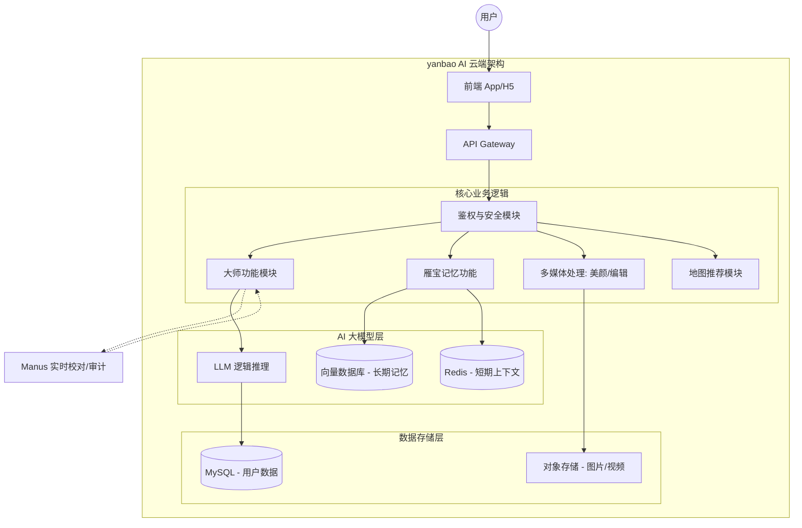
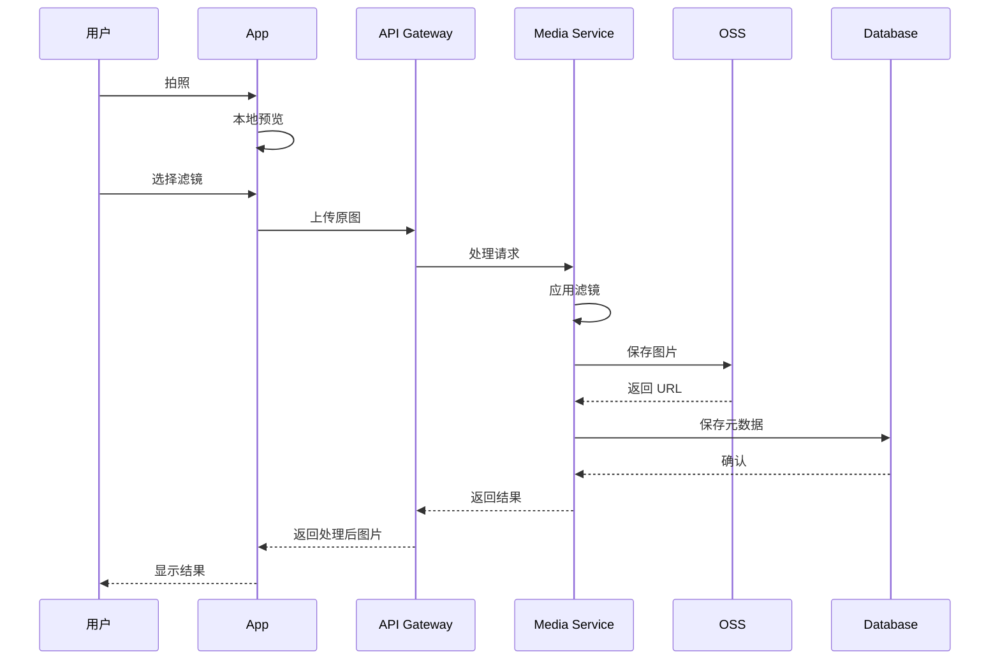
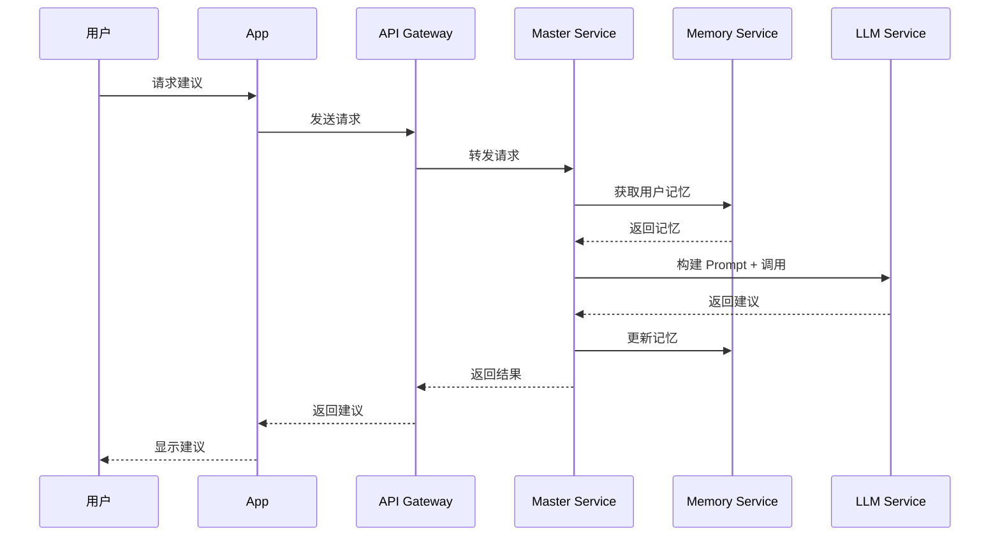

# yanbao AI 云端架构文档

## 📐 系统架构概览

### 核心架构图 (Mermaid)



---

## 🏗️ 架构分层说明

### 1. 前端层 (Frontend)

#### 移动端 (React Native + Expo)
- **技术栈**: React Native 0.83.1, Expo 54.0.31, TypeScript
- **核心组件**:
  - `App.tsx` - 主应用导航
  - `CameraScreen.tsx` - 美颜相机
  - `EditorScreen.tsx` - 照片编辑器
  - `GalleryScreen.tsx` - 相册管理
  - `MapScreen.tsx` - 地图推荐

#### Web 端 (Vite + React)
- **位置**: `client/` 目录
- **用途**: 官网展示、Web 版功能

### 2. API 网关层 (API Gateway)

#### 路由设计
```
/api/v1/auth/*          - 鉴权相关
/api/v1/master/*        - 大师功能
/api/v1/memory/*        - 雁宝记忆
/api/v1/media/*         - 多媒体处理
/api/v1/map/*           - 地图推荐
```

#### 技术选型
- **框架**: Express.js / Fastify
- **认证**: JWT + OAuth 2.0
- **限流**: Redis + rate-limiter
- **监控**: Prometheus + Grafana

### 3. 核心业务逻辑层

#### 3.1 大师功能模块 (Master Mode)

**功能定位**:
- 摄影大师：拍摄建议、构图指导
- 编辑大师：调色方案、滤镜推荐
- 地点大师：拍摄地点推荐、最佳时间

**技术实现**:
```typescript
interface MasterRequest {
  userId: string;
  masterType: 'photography' | 'editing' | 'location';
  userInput: string;
  context?: UserMemory;
}

interface MasterResponse {
  advice: string;
  suggestions: string[];
  confidence: number;
}
```

#### 3.2 雁宝记忆功能 (yanbao Memory)

**记忆类型**:
- **短期记忆**: Redis (会话级，24小时)
- **长期记忆**: 向量数据库 (永久存储)

**记忆内容**:
- 用户偏好（色调、风格、构图）
- 拍摄习惯（时间、地点、频率）
- 编辑配方（常用滤镜、参数）
- 收藏地点（拍摄点、评分、笔记）

**数据流程**:
```
用户输入 → 实体提取 → 向量化 → 存储
查询请求 → 语义检索 → 召回记忆 → 注入 Prompt
```

#### 3.3 多媒体处理模块 (Media Processing)

**功能清单**:
- 美颜算法（实时/离线）
- 滤镜应用（12种预设）
- 参数调节（亮度/对比度/饱和度）
- 图片压缩与优化

**技术栈**:
- **AI 美颜**: TensorFlow Lite / OpenCV
- **图片处理**: Sharp / ImageMagick
- **视频处理**: FFmpeg

#### 3.4 地图推荐模块 (Map Recommendations)

**推荐逻辑**:
```
用户位置 + 记忆标签 + 时间因素 → 个性化推荐
```

**数据源**:
- 上海拍摄地点数据库（6个核心地点）
- 用户收藏和评分
- 社区推荐（未来扩展）

### 4. AI 大模型层

#### 4.1 LLM 逻辑推理

**模型选择**:
- **主模型**: GPT-4 / Claude 3
- **备用模型**: Gemini 2.5 Flash
- **本地模型**: Llama 3 (成本优化)

**Prompt 工程**:
```python
system_prompt = f"""
你是 yanbao AI 的{master_type}大师。
用户背景：{user_memory}
当前任务：{task_description}
请提供专业、个性化的建议。
"""
```

#### 4.2 向量数据库 (Vector DB)

**技术选型**:
- **首选**: Pinecone (托管服务)
- **备选**: Milvus (自托管)
- **开发**: Chroma (本地测试)

**索引配置**:
```python
{
  "dimension": 1536,  # OpenAI embedding
  "metric": "cosine",
  "index_type": "HNSW"
}
```

#### 4.3 Redis 缓存层

**用途**:
- 会话上下文缓存
- API 响应缓存
- 限流计数器
- 分布式锁

**数据结构**:
```
user:{uid}:session     - Hash (会话数据)
user:{uid}:context     - List (对话历史)
api:ratelimit:{key}    - String (限流计数)
```

### 5. 数据存储层

#### 5.1 MySQL 数据库

**表结构设计**:

```sql
-- 用户表
CREATE TABLE users (
  id BIGINT PRIMARY KEY AUTO_INCREMENT,
  username VARCHAR(50) UNIQUE NOT NULL,
  email VARCHAR(100) UNIQUE,
  created_at TIMESTAMP DEFAULT CURRENT_TIMESTAMP
);

-- 照片表
CREATE TABLE photos (
  id BIGINT PRIMARY KEY AUTO_INCREMENT,
  user_id BIGINT NOT NULL,
  file_url VARCHAR(500) NOT NULL,
  metadata JSON,
  created_at TIMESTAMP DEFAULT CURRENT_TIMESTAMP,
  FOREIGN KEY (user_id) REFERENCES users(id)
);

-- 记忆表
CREATE TABLE memories (
  id BIGINT PRIMARY KEY AUTO_INCREMENT,
  user_id BIGINT NOT NULL,
  memory_type ENUM('preference', 'habit', 'recipe', 'location'),
  content TEXT,
  vector_id VARCHAR(100),
  created_at TIMESTAMP DEFAULT CURRENT_TIMESTAMP,
  FOREIGN KEY (user_id) REFERENCES users(id)
);

-- 配方表
CREATE TABLE recipes (
  id BIGINT PRIMARY KEY AUTO_INCREMENT,
  user_id BIGINT NOT NULL,
  name VARCHAR(100),
  filters JSON,
  parameters JSON,
  created_at TIMESTAMP DEFAULT CURRENT_TIMESTAMP,
  FOREIGN KEY (user_id) REFERENCES users(id)
);
```

#### 5.2 对象存储 (OSS)

**存储结构**:
```
/photos/{user_id}/{year}/{month}/{photo_id}.jpg
/thumbnails/{user_id}/{photo_id}_thumb.jpg
/videos/{user_id}/{video_id}.mp4
```

**CDN 加速**:
- 全球 CDN 节点
- 智能压缩
- WebP 自动转换

---

## 🔐 安全架构

### 认证与授权

#### JWT Token 结构
```json
{
  "sub": "user_id",
  "role": "user",
  "exp": 1234567890,
  "iat": 1234567890
}
```

#### 权限控制
```
用户 (User)        - 基础功能
会员 (Premium)     - 高级滤镜、无限存储
管理员 (Admin)     - 系统管理、数据审计
```

### 数据安全

- **传输加密**: HTTPS/TLS 1.3
- **存储加密**: AES-256
- **敏感数据**: 单独加密存储
- **备份策略**: 每日增量 + 每周全量

---

## 📊 监控与运维

### 监控指标

#### 系统指标
- CPU/内存使用率
- 磁盘 I/O
- 网络流量

#### 业务指标
- API 请求量
- 响应时间 (P50/P95/P99)
- 错误率
- 用户活跃度

#### AI 指标
- LLM 调用次数
- Token 消耗量
- 向量检索延迟
- 缓存命中率

### 日志系统

```
应用日志 → Fluentd → Elasticsearch → Kibana
错误日志 → Sentry
性能日志 → Prometheus → Grafana
```

---

## 🚀 部署架构

### 开发环境
```
本地开发 → Docker Compose
- MySQL 容器
- Redis 容器
- Minio (OSS 模拟)
```

### 测试环境
```
云服务器 (单机)
- 数据库: RDS
- 缓存: Redis Cloud
- 存储: OSS
```

### 生产环境
```
Kubernetes 集群
- API Gateway: 3 副本
- 业务服务: 5 副本 (自动扩缩容)
- 数据库: 主从复制 + 读写分离
- Redis: 哨兵模式
- OSS: 多区域备份
```

---

## 🔄 数据流转

### 拍照 → 编辑 → 保存流程



### 大师功能调用流程



---

## 📈 扩展性设计

### 水平扩展
- **无状态服务**: 所有业务服务无状态，可任意扩展
- **数据库分片**: 按用户 ID 分片
- **缓存集群**: Redis Cluster

### 垂直扩展
- **服务拆分**: 按业务模块拆分微服务
- **数据库优化**: 读写分离、索引优化
- **CDN 加速**: 静态资源全球加速

---

## 🎯 性能指标

### 目标 SLA

| 指标 | 目标值 |
|------|--------|
| API 响应时间 (P95) | < 500ms |
| 图片上传时间 | < 2s |
| 滤镜处理时间 | < 1s |
| 大师功能响应 | < 3s |
| 系统可用性 | 99.9% |

---

## 📝 技术栈总结

### 前端
- React Native 0.83.1
- Expo 54.0.31
- TypeScript 5.6.3
- React Navigation

### 后端
- Node.js 20.x
- Express.js / Fastify
- TypeScript
- Python 3.11 (AI 服务)

### 数据库
- MySQL 8.0
- Redis 7.0
- Pinecone / Milvus (向量数据库)

### AI / ML
- OpenAI GPT-4
- TensorFlow Lite
- OpenCV

### 基础设施
- Docker / Kubernetes
- Nginx
- Prometheus + Grafana
- ELK Stack

---

**架构设计**: Jason Tsao  
**更新时间**: 2026年1月17日
